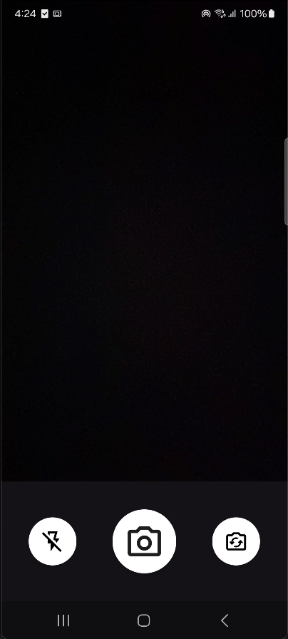
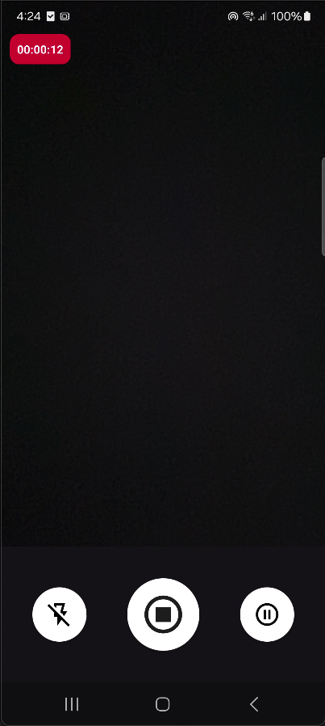
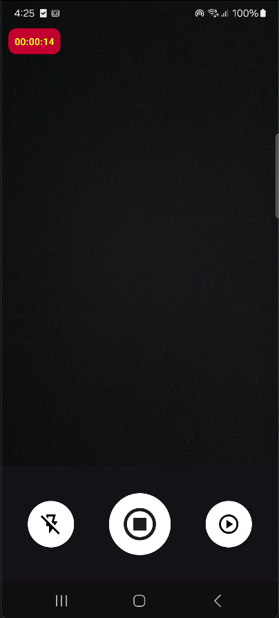

# Android Components

**Android Components** is an open-source library of prebuilt, plug-and-play modules for Android development. The goal is to provide commonly used features—like camera integration—with ready-to-use UIs and APIs that can be easily imported, used as-is, or extended in your own projects.

> **Current Available Module:**  
> ### EasyCamera — CameraX made simple

---

## EasyCamera (CameraX Library for Android)

EasyCamera provides drop-in CameraX support for Android with a modern UI and all the essentials—take photos, record video, flash, lens flip, pause/resume recording, and timer overlay. All boilerplate is handled for you!

#### Features
- One-tap capture (photo)
- Long-press capture (video)
- Pause/Resume recording
- Timer overlay (with pause blink)
- Flash toggle (auto-hide for front camera)
- Lens switch (front/back)
- Permission flow auto-handled

#### Quick Start

1. **Clone this repo.**
2. **Import the `easycamera` module** into your Android Studio project.
3. **Add permissions** in your `AndroidManifest.xml`:

    ```xml
    <uses-permission android:name="android.permission.CAMERA"/>
    <uses-permission android:name="android.permission.RECORD_AUDIO"/>
    <uses-permission android:name="android.permission.WRITE_EXTERNAL_STORAGE"/>
    ```

4. **Launch the sample UI:**
    ```java
    Intent intent = new Intent(context, CameraUI.class);
    startActivity(intent);
    ```
5. **Or integrate `CameraKit` in your own Activity/Fragment.**

#### Sample UI





---

## Project Structure

- `/easycamera` — CameraX-based camera module (drop-in or customizable)
- *(More modules coming soon!)*

---

Have a suggestion? [Open an issue](#) or submit a PR!

---

### Contributing

- Fork the repo
- Make your changes
- Open a pull request

---

**MIT License. Free to use, share, and modify!**

